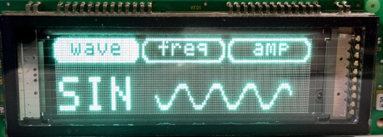

<!-- TOC -->
* [More Futaba NAGP1250 Examples](#more-futaba-nagp1250-examples)
  * [Advanced Examples](#advanced-examples)
    * [Merging graphics and text LIKE A BOSS](#merging-graphics-and-text-like-a-boss)
    * [Drawing Circles and Lines](#drawing-circles-and-lines)
    * [Merging Graphics, Text, and independent Dynamic Windows](#merging-graphics-text-and-independent-dynamic-windows)
    * [ESP32 Wi-Fi Clock](#esp32-wi-fi-clock)
    * [ESP32 Wi-Fi Clock with clock face](#esp32-wi-fi-clock-with-clock-face)
    * [ESP32 Wi-Fi Weather](#esp32-wi-fi-weather)
    * [Mixing text and graphics with beveled boxes in user-defined windows](#mixing-text-and-graphics-with-beveled-boxes-in-user-defined-windows)
  * [Animated Graphics](#animated-graphics)
    * [Generating Waveforms](#generating-waveforms)
    * [Pixel Blocks](#pixel-blocks)
    * [Radial lines](#radial-lines)
    * [Filling in a circle](#filling-in-a-circle)
<!-- TOC -->

# More Futaba NAGP1250 Examples

## Advanced Examples

### Merging graphics and text LIKE A BOSS

**CODE**: [EXAMPLES/graphics_and_text_like_a_boss.py](EXAMPLES/graphics_and_text_like_a_boss.py)


### Drawing Circles and Lines

**CODE**: [EXAMPLES/circles_lines_circuit_traces.py](EXAMPLES/circles_lines_circuit_traces.py)


### Merging Graphics, Text, and independent Dynamic Windows

**CODE**: [EXAMPLES/graphics_text_dynamic_windows.py](EXAMPLES/graphics_text_dynamic_windows.py)


### ESP32 Wi-Fi Clock

* Uses the ESP32's built-in Wi-Fi module to connect to a Wi-Fi network.
  * Leverages [Micropython WifiManager](https://github.com/mitchins/micropython-wifimanager).
* Synchronizes time with NTP
* Fetches timezone information from [WorldTimeAPI](https://worldtimeapi.org).
* Uses user-defined windows so only the portion of the display that needs updating is updated.

This example assumes `wifi_manager.py` and `networks.json` in the root directory of the ESP32 alongside the script.

**CODE**: [EXAMPLES/esp32_wifi_clock.py](EXAMPLES/esp32_wifi_clock.py)


### ESP32 Wi-Fi Clock with clock face

Similar to the [ESP32 Wi-Fi Clock](#esp32-wi-fi-clock) example, but time-only with a clock face.

There are a couple of helper functions in the example code that can align the hour to the literal hour or move it closer to the next hour as a regular clock would.

**CODE**: [EXAMPLES/esp32_wifi_clock_clockface.py](EXAMPLES/esp32_wifi_clock_clockface.py)


### ESP32 Wi-Fi Weather

* Uses the ESP32's built-in Wi-Fi module to connect to a Wi-Fi network.
  * Leverages [Micropython WifiManager](https://github.com/mitchins/micropython-wifimanager).
* Fetches weather data from [OpenWeatherMap](https://openweathermap.org).
  * (this service requires a free account to get an API key)
* Relies on user-provided bitmaps stores as arrays in JSON files in `/weather/32` on the ESP32 filesystem.

Please note the API key in the code is _example only_ and will not work. ;-P

I downloaded SVGs and converted them to PNGs (in Python using `cairosvg`) and then resized them to 32px and converted those to bitmap arrays (in Python using `Pillow` and `numpy`) then stored the bitmap arrays in .json files. I copied the .json files do the ESP32 filesystem under `/weather/32` (I created directories for multiple sizes); for example, the icon `forecast-weather-sun-sunny-hot-summer` is stored in `/weather/32/forecast-weather-sun-sunny-hot-summer.json`.

**CODE**: [EXAMPLES/esp32_wifi_weather.py](EXAMPLES/esp32_wifi_weather.py)


### Mixing text and graphics with beveled boxes in user-defined windows

**CODE**: [EXAMPLES/graphics_text_boxes.py](EXAMPLES/graphics_text_boxes.py)



## Animated Graphics

### Generating Waveforms

This features helper classes for each of the waveforms to generate incremental bitmaps. Each waveform is its own user-defined window that can be updated independently. Each window allows for a gap that shows the vertical lines from the base window, so no vertical lines need to be re-drawn, efficient++.

This is very taxing on the display's processor, so an artificial delay of 3ms is added when writing each waveform bitmap. If you get scrambled data on your display while trying this code, then you may need to increase this artificial delay 

**CODE**: [EXAMPLES/animated_waveforms.py](EXAMPLES/animated_waveforms.py)


### Pixel Blocks

This is a painfully inefficient way to generate 1x1, 2x2, and 4x4 blocks, but it works and totally gives the W.O.P.R. vibes (from the movie War Games).

**CODE**: [EXAMPLES/animated_pixel_blocks.py](EXAMPLES/animated_pixel_blocks.py)


This is a much more efficient way of randomizing 1px blocks: 
```python
random_bytes = [[urandom.getrandbits(1) for _ in range(width)] for _ in range(height)]
```

### Radial lines

**CODE**: [EXAMPLES/animated_radial_lines.py](EXAMPLES/animated_radial_lines.py)


(this GIF is slower than the actual example)

### Filling in a circle

**CODE**: [EXAMPLES/animated_circle_filling.py](EXAMPLES/animated_circle_filling.py)


(this GIF is slower than the actual example)
