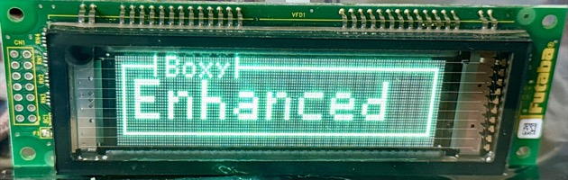

<!-- TOC -->
* [More Futaba NAGP1250 Examples](#more-futaba-nagp1250-examples)
  * [Advanced Examples](#advanced-examples)
    * [Merging graphics and text LIKE A BOSS](#merging-graphics-and-text-like-a-boss)
    * [Drawing Circles and Lines](#drawing-circles-and-lines)
    * [Merging Graphics, Text, and independent Dynamic Windows](#merging-graphics-text-and-independent-dynamic-windows)
  * [Animated Graphics](#animated-graphics)
    * [Pixel Blocks](#pixel-blocks)
<!-- TOC -->

# More Futaba NAGP1250 Examples

## Advanced Examples

### Merging graphics and text LIKE A BOSS

```python
from futaba import NAGP1250

vfd = NAGP1250(sin=33, sck=37, reset=39, sbusy=35)

# Create blank bitmap
width = 140
height = 32
bitmap = [[0 for _ in range(width)] for _ in range(height)]

# Remember to set your cursor position so the display knows where to start drawing.
vfd.set_cursor_position(x=0, y=0)

bitmap = vfd.draw_graphic_lines(bitmap=bitmap, lines=[
    (3, 3, 0, 13),      # Top left horizontal
    (16, 0, 270, 7),    # Top left pipe
    (50, 0, 270, 7),    # Top right pipe
    (50, 3, 0, 86),     # Top right horizontal

    (3, 3, 270, 25),    # Left vertical
    (136, 3, 270, 25),  # Right vertical

    (3, 27, 0, 134)     # Bottom horizontal
], width=width, height=height)

packed = vfd.pack_bitmap(bitmap=bitmap, width=width, height=height)
vfd.display_realtime_image(image_data=packed, width=width, height=height)

# Move the cursor to the first row (0) and the 20th column, in the middle of the vertical pipes
vfd.set_cursor_position(x=20, y=0)

vfd.write_text("Boxy")

# Move the cursor to the second row (1) and the 6th column, the beginning of the open area
vfd.set_cursor_position(x=6, y=1)

# Set the font magnification to 2 rows and 2 columns
vfd.set_font_magnification(h=2, v=2)

vfd.write_text("Enhanced")
```



### Drawing Circles and Lines

```python
vfd = NAGP1250(sin=33, sck=37, reset=39, sbusy=35)

# Create blank bitmap
width = 140
height = 32
bitmap = [[0 for _ in range(width)] for _ in range(height)]

# (x, y, radius, filled[boolean])
bitmap = vfd.draw_graphic_circles(bitmap=bitmap, circles=[
    (10, 8, 2, False),    # S1
    (10, 16, 2, False),   # S2
    (10, 24, 2, False),   # S3
    (50, 20, 2, False),   # S4
    (90, 10, 2, False),   # S5
    (130, 3, 2, False),   # E1
    (130, 10, 2, False),  # E2
    (130, 18, 2, False),  # E3
    (130, 25, 2, False),  # E4
    (130, 25, 2, False),  # E4
], width=width, height=height)

# Use the first updated bitmap to add lines to

# (x, y, angle_deg, length)
bitmap = vfd.draw_graphic_lines(bitmap=bitmap, lines=[
    # S1
    (13, 8, 0, 20),
    (33, 8, 45, 8),
    (39, 3, 0, 90),

    # S4-S5
    (53, 20, 0, 15),
    (68, 20, 45, 15),
    (79, 10, 0, 10),

    # S4-S5-E3
    (93, 10, 0, 10),
    (103, 10, 315, 12),
    (112, 18, 0, 17),

    # S2-E2
    (13, 16, 0, 50),
    (63, 16, 45, 15),
    (73, 6, 0, 33),
    (105, 6, 315, 5),
    (109, 10, 0, 19),

    # S3-E4
    (13, 24, 0, 30),
    (43, 24, 315, 3),
    (45, 25, 0, 83),
], width=width, height=height)

packed = vfd.pack_bitmap(bitmap=bitmap, width=width, height=height)
vfd.display_realtime_image(image_data=packed, width=width, height=height)
```


### Merging Graphics, Text, and independent Dynamic Windows

```python
from futaba import NAGP1250

vfd = NAGP1250(sin=33, sck=37, reset=39, sbusy=35)

# Text to be used at the top
text = "Fancy Box"
# How far the top text should be indented from the left
left_indent = 14

# Create blank bitmap
width = 140
height = 32
bitmap = [[0 for _ in range(width)] for _ in range(height)]

# Assigning starting positions to variables for readability
start_x = 0
start_y = 0
# Assigning directions to variables for readability
hor_l_to_r = 0
vert_t_to_b = 270

# Text is 5x7 so 5*L
empty_width = (len(text) * 7) + 4

vfd.set_cursor_position(x=0, y=0)

# (x, y, angle_deg, length)
bitmap = vfd.draw_graphic_lines(bitmap=bitmap, lines=[
    # Outer
    (start_x, start_y, hor_l_to_r, left_indent),                                                     # Top left horizontal
    (left_indent + empty_width + 1, hor_l_to_r, hor_l_to_r, width - 1 - empty_width - left_indent),  # Top right horizontal
    (start_x, 1, vert_t_to_b, height - 2),                                                           # Left vertical
    (width - 1, hor_l_to_r, vert_t_to_b, height),                                                    # Right vertical
    (start_x, height - 1, hor_l_to_r, width),                                                        # Bottom horizontal

    # Inner 1
    (start_x + 2, start_y + 2, hor_l_to_r, left_indent - 2),                                          # Top left horizontal
    (left_indent + empty_width + 1, start_y + 2, hor_l_to_r, width - 3 - empty_width - left_indent),  # Top right horizontal
    (start_x + 2, start_y + 2, vert_t_to_b, height - 6),                                              # Left vertical
    (width - 3, start_y + 2, vert_t_to_b, height - 4),                                                # Right vertical
    (start_x + 2, height - 3, hor_l_to_r, width - 4),                                                 # Bottom horizontal

    # Inner 2
    (start_x + 4, start_y + 4, hor_l_to_r, left_indent - 4),                                          # Top left horizontal
    (left_indent + empty_width + 1, start_y + 4, hor_l_to_r, width - 5 - empty_width - left_indent),  # Top right horizontal
    (start_x + 4, start_y + 4, vert_t_to_b, height - 9),                                              # Left vertical
    (width - 5, start_y + 4, vert_t_to_b, height - 8),                                                # Right vertical
    (start_x + 4, height - 5, hor_l_to_r, width - 8),                                                 # Bottom horizontal

    # Inner 3
    (start_x + 6, start_x + 6, hor_l_to_r, left_indent - 6),                                          # Top left horizontal
    (left_indent + empty_width + 1, start_y + 6, hor_l_to_r, width - 7 - empty_width - left_indent),  # Top right horizontal
    (start_x + 6, start_y + 6, vert_t_to_b, height - 13),                                             # Left vertical
    (width - 7, start_y + 6, vert_t_to_b, height - 12),                                               # Right vertical
    (start_x + 6, height - 7, hor_l_to_r, width - 12),                                                # Bottom horizontal

    (left_indent, start_y, vert_t_to_b, 7),                    # Top left pipe
    (left_indent + empty_width + 1, start_y, vert_t_to_b, 7),  # Top right pipe
], width=width, height=height)

packed = vfd.pack_bitmap(bitmap=bitmap, width=width, height=height)
vfd.display_realtime_image(image_data=packed, width=width, height=height)

vfd.define_user_window(window_num=1, x=left_indent + 3, y=0, w=empty_width, h=1)
vfd.define_user_window(window_num=2, x=8, y=1, w=123, h=2)

# Move the cursor inside the vertical pipes, make sure there is a 2px buffer
vfd.do_select_window(window_num=1)
vfd.do_home()

vfd.write_text(text)

vfd.do_select_window(window_num=2)
vfd.do_home()

vfd.set_font_magnification(h=2, v=2)
vfd.write_text("Enhanced")
```


## Animated Graphics

### Pixel Blocks

This is a painfully inefficient way to generate 1x1, 2x2, and 4x4 blocks, but it works and totally gives the W.O.P.R. vibes (from the movie War Games).

```python
import random
from futaba import NAGP1250


def generate_block_bitmap(width: int = 140, height: int = 32, block_size: int = 1) -> list[list[int]]:
    """
    Generate a 2D bitmap representation of binary blocks.

    This function generates a bitmap where each "block" is composed of square grids (block_size x block_size) filled
    with either 1s or 0s. The size of the bitmap is defined by the width and height parameters, while the granularity
    of blocks is controlled by the block_size parameter.

    :param width: The total width of the resulting bitmap in pixels.
    :type width: int
    :param height: The total height of the resulting bitmap in pixels.
    :type height: int
    :param block_size: The size of each block in pixels. Possible values are 1, 2, or 4.
    :type block_size: int
    :return: A 2D list where each element represents a single pixel value (0 or 1).
    :raises ValueError: If block_size is not one of the valid options (1, 2, 4).
    """
    if block_size not in [1, 2, 4]:
        raise ValueError("block_size must be 1, 2 or 4")

    block_w = width // block_size
    block_h = height // block_size
    bitmap = []

    for _ in range(block_h):
        # Create block_size rows per block row
        block_rows = [[] for _ in range(block_size)]
        for _ in range(block_w):
            bit = random.getrandbits(1)
            # Fill block_size × block_size pixels with the same bit
            for row in block_rows:
                row.extend([bit] * block_size)
        bitmap.extend(block_rows)

    return bitmap


vfd = NAGP1250(sin=33, sck=37, reset=39, sbusy=35)

while True:
    random_bytes = generate_block_bitmap(width=width, height=height, block_size=4)

    packed = vfd.pack_bitmap(bitmap=random_bytes, width=width, height=height)

    vfd.display_realtime_image(image_data=packed, width=width, height=height)
```


This is a much more efficient way of randomizing 1px blocks: 
```python
random_bytes = [[urandom.getrandbits(1) for _ in range(width)] for _ in range(height)]
```

### Pixel Blocks

This is a painfully inefficient way to generate 1x1, 2x2, and 4x4 blocks, but it works and totally gives the W.O.P.R. vibes (from the movie War Games).

```python
vfd = NAGP1250(sin=33, sck=37, reset=39, sbusy=35)

# Number of radial elements
count = 30
# Length of radial elements
length = 100
# Center point for radial elements
lx = 70
ly = 16

# Create blank bitmap
width = 140
height = 32
bitmap = [[0 for _ in range(width)] for _ in range(height)]

# Compute angle step (e.g. 360° / 12 = 30° per line)
step = 360 / count

# Draw each radial line and update the bitmap
for i in range(count):
    angle = i * step
    bitmap = vfd.draw_graphic_lines(bitmap=bitmap, lines=[(lx, ly, angle, length)], width=width, height=height)

    packed = vfd.pack_bitmap(bitmap=bitmap, width=width, height=height)
    vfd.display_realtime_image(image_data=packed, width=width, height=height)
```


### Filling in a circle

```python
vfd = NAGP1250(sin=33, sck=37, reset=39, sbusy=35)

# Step degrees
step_deg = 5

# Center point for radial elements
cx = 70
cy = 12

# Create blank bitmap
width = 140
height = 32
bitmap = [[0 for _ in range(width)] for _ in range(height)]

angle = 0
while True:
    # Draw rotating line
    bitmap = vfd.draw_graphic_lines(bitmap=bitmap, lines=[(cx, cy, angle, 10)], width=width, height=height)

    # Optional: draw center dot or filled circle
    # bitmap = vfd.draw_graphic_circle_filled(bitmap=bitmap, cx=cx, cy=cy, radius=2)

    packed = vfd.pack_bitmap(bitmap=bitmap, width=width, height=height)
    vfd.display_realtime_image(image_data=packed, width=width, height=height)

    # Advance angle
    angle = (angle + step_deg) % 360
```


