<!-- TOC -->
* [MicroPython Futaba NAGP1250 VFD display driver](#micropython-futaba-nagp1250-vfd-display-driver)
  * [OMG WHERE DO I GET ONE?](#omg-where-do-i-get-one)
  * [Datasheets](#datasheets)
  * [Display Configuration](#display-configuration)
    * [Jumpers](#jumpers)
    * [Interface](#interface)
  * [Example Wiring for an ESP32 S2 Mini](#example-wiring-for-an-esp32-s2-mini)
  * [Example Code](#example-code)
    * [Basic Text](#basic-text)
    * [International Text](#international-text)
    * [Font Magnification](#font-magnification)
      * [BIG](#big)
      * [Horizontal span 2, Vertical span 1](#horizontal-span-2-vertical-span-1)
      * [Horizontal span 1, Vertical span 2](#horizontal-span-1-vertical-span-2)
    * [Horizontal Scrolling](#horizontal-scrolling)
    * [Horizontal Scroll Speed](#horizontal-scroll-speed)
    * [User-Defined Windows](#user-defined-windows)
    * [User-Defined Windows with Mixed Magnifications](#user-defined-windows-with-mixed-magnifications)
    * [User-Defined Windows with Scrolling](#user-defined-windows-with-scrolling)
    * [Partial Inversion](#partial-inversion)
    * [Alternating Character Inversion](#alternating-character-inversion)
    * [Flashing Inverted / Blinking](#flashing-inverted--blinking)
    * [Displaying a graphic](#displaying-a-graphic)
    * [Displaying a graphic with text using windows](#displaying-a-graphic-with-text-using-windows)
    * [Drawing lines](#drawing-lines)
    * [Merging multiple graphics with logical mode OR](#merging-multiple-graphics-with-logical-mode-or)
    * [Merging graphics and text](#merging-graphics-and-text)
    * [Merging graphics and text LIKE A BOSS](#merging-graphics-and-text-like-a-boss)
  * [Graphics](#graphics)
    * [Driver `pack_bitmap` static method](#driver-pack_bitmap-static-method)
* [TODO](#todo)
* [Thank You <3](#thank-you-3)
<!-- TOC -->

# MicroPython Futaba NAGP1250 VFD display driver

**Built on MicroPython 1.25.0.**

This is a relatively quick driver I wrote for the NAGP1250-BA display that I have using synchronous serial communications based off its datasheet and then supplemented with the correct datasheet lol.

This is my first driver, so please be gentle with me. :^)

There are some minor differences between the various submodels (AA, AB, BA, BB), and I started writing this driver using features that my display didn't currently support. This driver doesn't differentiate, so if a feature doesn't work correctly, then it's possible the display does not support the feature or the code might need updating.

## OMG WHERE DO I GET ONE?

I got mine from the [Murphy's Surplus](https://murphyjunk.net) [eBay store](https://www.ebay.com/str/murphyjunk). I don't know how long this URL will be valid, but the specific item listing where I got mine from is: [https://www.ebay.com/itm/203833526968](https://www.ebay.com/itm/203833526968)

## Datasheets

Each datasheet provides a different perspective on the display, aside from command differences, so both are worth looking at even if you're using the slightly less feature-rich -BA display like I am.

* [Futaba-04-20-2020-NAGP1250AB-0-1839372.pdf](_datasheets/Futaba-04-20-2020-NAGP1250AB-0-1839372.pdf)
* [dbFutaba_MFD-M_NAGP1250_EN.pdf](_datasheets/dbFutaba_MFD-M_NAGP1250_EN.pdf)

## Display Configuration

For my example, I'm using the synchronous serial interface which needs only JP2 shorted (this is the default for how my display came) that uses the 6-pin CN2 header located at the bottom of the board. While you can solder wires directly to these holes, I do not recommend it and would suggest soldering a 6-pin header.

CN2 pin 1 is located at the far right when looking at the back, which is indicated by a mark right by the CN2 label.

[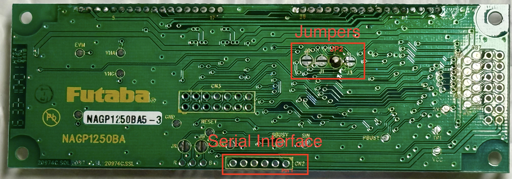](_images/display-marked.jpg)

### Jumpers

Mine are configured for synchronous serial with J2 shorted, and that is how I designed this driver with that in mind.

| J0      | J1      | J2      | J3      | Function                                                                                                                                                         |
|---------|---------|---------|---------|------------------------------------------------------------------------------------------------------------------------------------------------------------------|
| open    | open    | open    | X       | Asynchronous serial at 38400 baud                                                                                                                                |
| shorted | open    | open    | X       | Asynchronous serial at 19200 baud                                                                                                                                |
| open    | shorted | open    | X       | Asynchronous serial at 9600 baud                                                                                                                                 |
| shorted | shorted | open    | X       | Asynchronous serial at 115200 baud                                                                                                                               |
| x       | x       | shorted | X       | Synchronous serial                                                                                                                                               |
| x       | x       | x       | shorted | Self-test image displayed at power-up and after a reset for about 4 seconds before the all dots on screen saver is displayed. (image includes software revision) |

(x = ignored)

### Interface

Keep in mind the display itself uses 5v logic and some MCU's, like the ESP32 and Raspberry Pi Pico, use 3.3v logic, so a bi-directional level shifter is needed.

My Arduino's use 5v logic, so no level shifter is needed, but you should check your MCU specifications/datasheet to make sure you whether you need a level shifter.

For synchronous serial, four of the six pins are used for communication and control, two of them are +5v and GROUND. Using SBUSY and RESET lines is optional, but I would recommend using them.

| Pin | Signal       |
|-----|--------------|
| 1   | VCC (+5v DC) |
| 2   | SIN          |
| 3   | GROUND       |
| 4   | SBUSY        |
| 5   | SCK          |
| 6   | /RESET       |

The maximum SCK frequency is 2.45mhz; my MCU has a theoretical SCK speed of 44mhz, so I tried to adjust timings to slow down that speed, but your MCU might be different and timings adjusted. If you would like to test your SCK frequency, you can use this MicroPython code:

```python
import time
from futaba import NAGP1250

vfd = NAGP1250(sin=33, sck=37, reset=39, sbusy=35)

pulses = 1000

# Warm-up
vfd.pin_sck.value(0)
time.sleep_ms(10)

# Start timing
start = time.ticks_us()
for _ in range(pulses):
    vfd.pin_sck.value(1)
    time.sleep_us(100)
    vfd.pin_sck.value(0)
    time.sleep_us(100)
end = time.ticks_us()

elapsed_us = time.ticks_diff(end, start)
freq = pulses / (elapsed_us / 1_000_000)  # Hz

print(f"SCK pulses: {pulses}")
print(f"Elapsed time: {elapsed_us} µs")
print(f"Estimated SCK frequency: {freq:.2f} Hz")
```

## Example Wiring for an ESP32 S2 Mini

I used the ESP32 S2 Mini because the dev board because it's pretty but has a built-in voltage regulator. This dev board can be powered from +5v DC through the VBUS-pin, or it can supply +5v DC through the VBUS pin when the dev board is powered via USB.

This MCU does use 3.3v logic, so a level shifter is needed; I used a simple 4-channel bidirectional shifter from HiLetgo. While any level shifter should work, some have different wiring and/or have an enable-pin, so please refer to your level shifter's documentation and wire accordingly.

Remember to load MicroPython on your MCU! ;-)

[](_images/futaba_esp32_wiring.png)

## Example Code

I tried to document the code as much as possible while including some key details from the datasheets. 

### Basic Text

```python
from futaba import NAGP1250

vfd = NAGP1250(sin=33, sck=37, reset=39, sbusy=35)
n = [chr(i) for i in range(128)]
vfd.write_text(text=n)
```

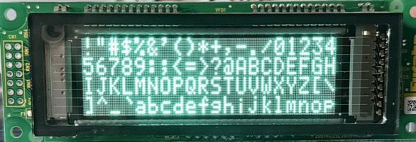

### International Text

The datasheets will be delightfully confusing, but this helps test some of the character maps.

```python
from futaba import NAGP1250
from futaba.NAGP1250 import CHAR_CODE_KATAKANA

vfd = NAGP1250(sin=33, sck=37, reset=39, sbusy=35)
vfd.set_character_code(code=CHAR_CODE_KATAKANA)

chars = list(range(0x80, 0xFF))
vfd.send_byte(data=chars)
```

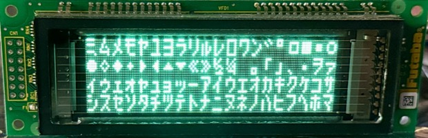

### Font Magnification

You can have characters occupy up to two columns and up to two rows to give each character a 4x4 area. 

#### BIG

```python
from futaba import NAGP1250

vfd = NAGP1250(sin=33, sck=37, reset=39, sbusy=35)
vfd.set_font_magnification(h=2, v=2)
vfd.write_text(text="Hello, World!")
```

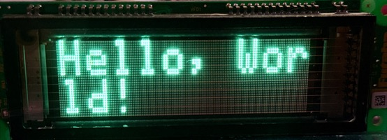

#### Horizontal span 2, Vertical span 1

```python
from futaba import NAGP1250

vfd = NAGP1250(sin=33, sck=37, reset=39, sbusy=35)
vfd.set_font_magnification(h=2, v=1)
vfd.write_text(text="Hello, World!")
```

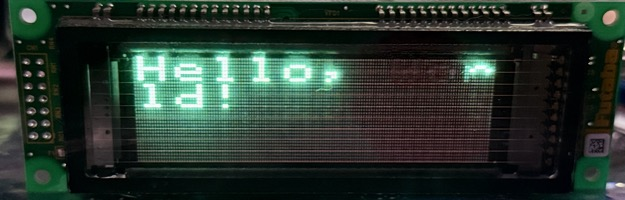

(my camera shutter speed didn't capture the whole image)

#### Horizontal span 1, Vertical span 2

```python
from futaba import NAGP1250

vfd = NAGP1250(sin=33, sck=37, reset=39, sbusy=35)
vfd.set_font_magnification(h=1, v=2)
vfd.write_text(text="Hello, World!")
```

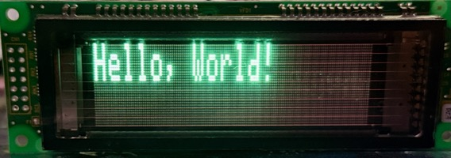

### Horizontal Scrolling

It's a little hard to demonstrate it in still photos, but trust me, it works. ;-)

```python
from futaba import NAGP1250

vfd = NAGP1250(sin=33, sck=37, reset=39, sbusy=35)
vfd.set_horizontal_scroll()
vfd.set_font_magnification(h=2, v=2)
vfd.write_text(text="Hello, World!")
```

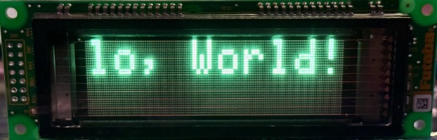

### Horizontal Scroll Speed

Scroll speed is approximately `S * 14ms per column` and the speed settings range from 1 to 31; 1 seems plenty fast, so maybe I need to slow the clock rate down. 

```python
from futaba import NAGP1250

vfd = NAGP1250(sin=33, sck=37, reset=39, sbusy=35)
vfd.set_horizontal_scroll()
vfd.set_horizontal_scroll_speed(speed=1)
vfd.set_font_magnification(h=2, v=2)
vfd.write_text(text="Hello, World!")
```

It's like the above but much more calm.

### User-Defined Windows

```python
from futaba import NAGP1250

vfd = NAGP1250(sin=33, sck=37, reset=39, sbusy=35)

vfd.define_user_window(window_num=1, x=0, y=0, w=140, h=3)
vfd.define_user_window(window_num=2, x=0, y=3, w=140, h=1)

vfd.do_select_window(window_num=1)
vfd.set_font_magnification(h=2, v=2)
vfd.write_text("( . )( . )")

vfd.do_select_window(window_num=2)
vfd.set_font_magnification(h=1, v=1)
vfd.write_text("    Hello, World!")
```

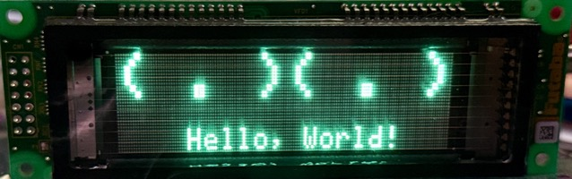

### User-Defined Windows with Mixed Magnifications

```python
from futaba import NAGP1250

vfd = NAGP1250(sin=33, sck=37, reset=39, sbusy=35)

vfd.define_user_window(window_num=1, x=0, y=0, w=140, h=2)
vfd.define_user_window(window_num=2, x=0, y=2, w=140, h=2)

vfd.do_select_window(window_num=1)
vfd.set_font_magnification(h=2, v=2)
vfd.write_text("Hello")

vfd.do_select_window(window_num=2)
vfd.set_font_magnification(h=1, v=2)
vfd.write_text("Hello, World!")
```

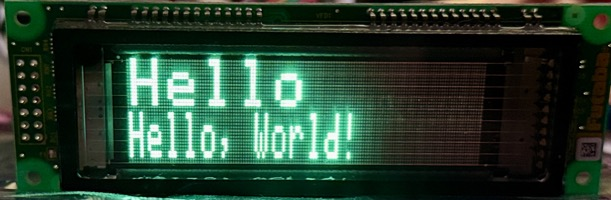

### User-Defined Windows with Scrolling

```python
from futaba import NAGP1250

vfd = NAGP1250(sin=33, sck=37, reset=39, sbusy=35)

vfd.define_user_window(window_num=1, x=0, y=0, w=140, h=3)
vfd.define_user_window(window_num=2, x=0, y=3, w=140, h=1)

vfd.do_select_window(window_num=1)
vfd.set_font_magnification(h=2, v=2)
vfd.write_text("( . )( . )")

vfd.do_select_window(window_num=2)
vfd.set_font_magnification(h=1, v=1)
vfd.set_horizontal_scroll()
vfd.set_horizontal_scroll_speed(speed=1)
vfd.write_text("Hello, World! Hello, World! Hello, World! Hello, World!")
```

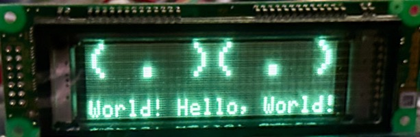

### Partial Inversion

```python
from futaba import NAGP1250

vfd = NAGP1250(sin=33, sck=37, reset=39, sbusy=35)

vfd.define_user_window(window_num=1, x=0, y=0, w=140, h=2)
vfd.define_user_window(window_num=2, x=0, y=2, w=140, h=2)

vfd.do_select_window(window_num=1)
vfd.set_reverse_display(mode=1)
vfd.set_font_magnification(h=2, v=2)
vfd.write_text("Hello")

vfd.do_select_window(window_num=2)
vfd.set_reverse_display(mode=0)
vfd.set_font_magnification(h=1, v=2)
vfd.write_text("Hello, World!")
```

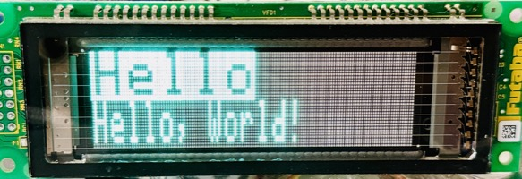

### Alternating Character Inversion

```python
from futaba import NAGP1250

vfd = NAGP1250(sin=33, sck=37, reset=39, sbusy=35)

vfd.define_user_window(window_num=1, x=0, y=0, w=140, h=2)
vfd.define_user_window(window_num=2, x=0, y=2, w=140, h=2)

vfd.do_select_window(window_num=1)
vfd.set_font_magnification(h=2, v=2)
vfd.write_text("Hello")

vfd.do_select_window(window_num=2)
vfd.set_font_magnification(h=1, v=2)

i = 0
for l in "Hello, World!":
    if i:
        vfd.set_reverse_display(mode=1)
    else:
        vfd.set_reverse_display(mode=0)

    vfd.write_text(l)

    if not i:
        i = 1
    else:
        i = 0
```

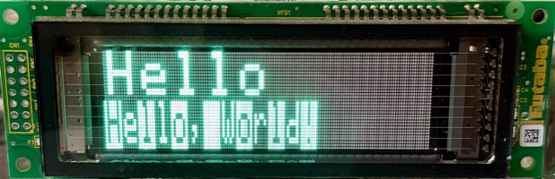

### Flashing Inverted / Blinking

```python
from futaba import NAGP1250

vfd = NAGP1250(sin=33, sck=37, reset=39, sbusy=35)
vfd.write_text(text="Hello, World!")

# `pattern=1` for blinking
vfd.do_blink_display(pattern=2, normal_time=100, blink_time=100, repetition=100)
```

| ⚠️ **SEIZURE WARNING** ⚠️                                                                                |
|----------------------------------------------------------------------------------------------------------|
| It is possible to make this screen blink at a rate that could trigger photosensitive epileptic episodes. |

### Displaying a graphic

```python
from futaba import NAGP1250

vfd = NAGP1250(sin=33, sck=37, reset=39, sbusy=35)

data = bytearray(b'\x00\x00\x02\xa0\x00\x00\rP\x00\x00\x12H\x00 ...')

vfd.display_realtime_image(image_data=data, width=26, height=32)
```

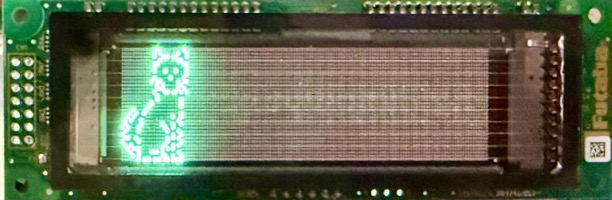

### Displaying a graphic with text using windows

```python
from futaba import NAGP1250

vfd = NAGP1250(sin=33, sck=37, reset=39, sbusy=35)

data = bytearray(b'\x00\x00\x02\xa0\x00\x00\rP\x00\x00\x12H\x00 ...')

vfd.display_realtime_image(image_data=data, width=26, height=32)

vfd.define_user_window(window_num=1, x=30, y=0, w=120, h=2)
vfd.define_user_window(window_num=2, x=30, y=2, w=120, h=2)

vfd.do_select_window(window_num=1)
vfd.set_font_magnification(h=2, v=2)
vfd.write_text("Hello")

vfd.do_select_window(window_num=2)
vfd.set_font_magnification(h=2, v=2)
vfd.write_text("World")
```

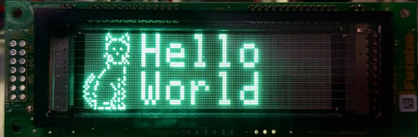

```python
from futaba import NAGP1250

vfd = NAGP1250(sin=33, sck=37, reset=39, sbusy=35)

data = bytearray(b'\x00\x00\x02\xa0\x00\x00\rP\x00\x00\x12H\x00 ...')

vfd.display_realtime_image(image_data=data, width=26, height=32)

vfd.define_user_window(window_num=1, x=30, y=0, w=120, h=2)
vfd.define_user_window(window_num=2, x=30, y=2, w=120, h=2)

vfd.do_select_window(window_num=1)
vfd.set_font_magnification(h=2, v=2)
vfd.write_text("Hello")

vfd.do_select_window(window_num=2)
vfd.set_font_magnification(h=2, v=2)
vfd.set_reverse_display(mode=1)
vfd.write_text("World")
```

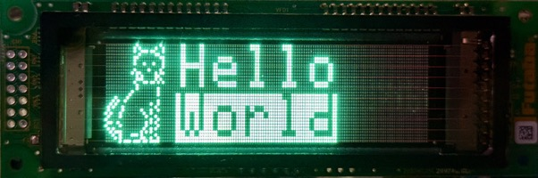

### Drawing lines

```python
from futaba import NAGP1250

vfd = NAGP1250(sin=33, sck=37, reset=39, sbusy=35)

# Remember to set your cursor position so the display knows where to start drawing.
vfd.set_cursor_position(x=0, y=0)

# (x, y, angle_deg, length)
vfd.draw_graphic_lines(lines=[
    (70, 16, 0, 30),    # Horizontal right
    (70, 16, 90, 15),   # Up
    (70, 16, 180, 30),  # Left
    (70, 16, 270, 15),  # Down
    (70, 16, 45, 20),   # Diagonal up-right
    (70, 16, 135, 20),  # Diagonal up-left
    (70, 16, 315, 20),  # Diagonal down-right
    (70, 16, 225, 20)   # Diagonal down-left
], width=140)
```

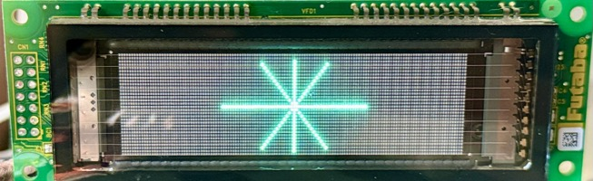

### Merging multiple graphics with logical mode OR

There are four modes used to merge new data with data already in memory, this example uses the logical OR mode so two graphics of the same size are displayed.

You can import `WRITE_MODE_OR` to use, or you can use the integer value `1`, I added the variable so it would be more human-readable. :^)
```python
WRITE_MODE_NORMAL = 0
WRITE_MODE_OR = 1
WRITE_MODE_AND = 2
WRITE_MODE_XOR = 3
```

```python
from futaba import NAGP1250
from futaba.NAGP1250 import WRITE_MODE_OR

vfd = NAGP1250(sin=33, sck=37, reset=39, sbusy=35)

vfd.set_write_logic(mode=WRITE_MODE_OR)

# Remember to set your cursor position so the display knows where to start drawing.
vfd.set_cursor_position(x=0, y=0)

# (x, y, angle_deg, length)
# Tuples
vfd.draw_graphic_lines(lines=[
    (70, 16, 0, 30),  # Horizontal right
    (70, 16, 90, 15),  # Up
    (70, 16, 180, 30),  # Left
    (70, 16, 270, 15),  # Down
    (70, 16, 45, 20),  # Diagonal up-right
    (70, 16, 135, 20),  # Diagonal up-left
    (70, 16, 315, 20),  # Diagonal down-right
    (70, 16, 225, 20)  # Diagonal down-left
], width=140)

# (x, y, angle_deg, length)
# Lists
vfd.draw_graphic_lines(lines=[
    [35, 16, 0, 30],  # Horizontal right
    [35, 16, 90, 15],  # Up
    [35, 16, 180, 30],  # Left
    [35, 16, 270, 15],  # Down
    [35, 16, 45, 20],  # Diagonal up-right
    [35, 16, 135, 20],  # Diagonal up-left
    [35, 16, 315, 20],  # Diagonal down-right
    [35, 16, 225, 20]  # Diagonal down-left
], width=140)
```

You can use tuples or lists for the `lines` parameter, whatever fits your design pattern best.

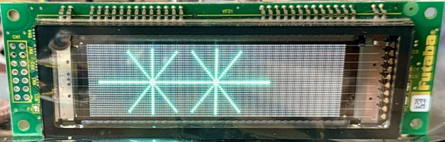

### Merging graphics and text

```python
from futaba import NAGP1250

vfd = NAGP1250(sin=33, sck=37, reset=39, sbusy=35)

# Remember to set your cursor position so the display knows where to start drawing.
vfd.set_cursor_position(x=0, y=0)

vfd.draw_graphic_lines(lines=[
    (3, 3, 0, 13),      # Top L horizontal
    (16, 0, 270, 7),    # Top L pipe
    (50, 0, 270, 7),    # Top R pipe
    (50, 3, 0, 86),     # Top R horizontal

    (3, 3, 270, 25),    # L vertical
    (136, 3, 270, 25),  # R vertical
    
    (3, 27, 0, 134)     # Bottom horizontal
], width=140)

# Move the cursor to the first row (0) and the 20th column, in the middle of the vertical pipes
vfd.set_cursor_position(x=20, y=0)

vfd.write_text("Boxy")
```

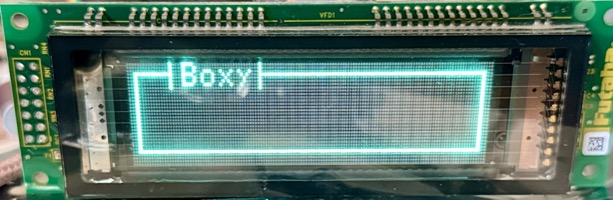

### Merging graphics and text LIKE A BOSS

```python
from futaba import NAGP1250

vfd = NAGP1250(sin=33, sck=37, reset=39, sbusy=35)

# Remember to set your cursor position so the display knows where to start drawing.
vfd.set_cursor_position(x=0, y=0)

vfd.draw_graphic_lines(lines=[
    (3, 3, 0, 13),      # Top left horizontal
    (16, 0, 270, 7),    # Top left pipe
    (50, 0, 270, 7),    # Top right pipe
    (50, 3, 0, 86),     # Top right horizontal

    (3, 3, 270, 25),    # Left vertical
    (136, 3, 270, 25),  # Right vertical

    (3, 27, 0, 134)     # Bottom horizontal
], width=140)

# Move the cursor to the first row (0) and the 20th column, in the middle of the vertical pipes
vfd.set_cursor_position(x=20, y=0)

vfd.write_text("Boxy")

# Move the cursor to the second row (1) and the 6th column, the beginning of the open area
vfd.set_cursor_position(x=6, y=1)

# Set the font magnification to 2 rows and 2 columns
vfd.set_font_magnification(h=2, v=2)

vfd.write_text("Enhanced")
```

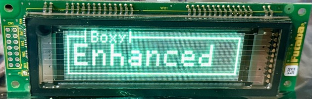

### MORE EXAMPLES

More examples can be found in [EXAMPLES.md](EXAMPLES.md).

## Graphics

Images need to be black and white 1-bit per pixel. I wrote a little Python function that leverages Pillow to pack the image and provide the dimensional data to use to send the graphic data to the display. 

> The Graphic Image is written to Display Memory as the Image Data bytes are received starting from
the current cursor location filling each row of a column of the Graphic Image from top to bottom,
from the left to the right column. The MSB of Image data represents the upper pixel of each byte in a
column.

The below code has not been tested with MicroPython's Pillow implementation and was designed as a quick and dirty solution for testing. In my example, I did a lot of photo magic to bring out the outlines, resizing, and level adjusting before running it through the below code.

```python
from PIL import Image

def pack_image_from_file(filepath: str, target_width: int = 140, target_height: int = 32) -> tuple[bytearray, int, int]:
    """
    Load and pack a 128×32 image into column-major bytes for the NAGP1250.

    :param filepath: Path to the image file to be processed.
    :type filepath: str
    :param target_width: (optional) Target width of the output image in pixels. (default: 140)
    :type target_width: int
    :param target_height: (optional) Target height of the output image in pixels. (default: 32)
    :type target_height: int
    :return: A tuple with the packed pixel data as a bytearray and both the width and height of the processed image.
    :rtype: tuple[bytearray, int, int]
    """
    # Load and convert to monochrome
    img = Image.open(filepath).convert("1")

    img = img.resize((target_width, target_height), Image.NEAREST)

    pixels = img.load()
    packed = bytearray()

    for x in range(target_width):
        for byte_row in range(0, target_height, 8):
            byte = 0
            for bit in range(8):
                y = byte_row + bit
                if pixels[x, y] == 0:  # Black pixel = ON
                    byte |= (1 << (7 - bit))
            packed.append(byte)

    return packed, target_width, target_height
```

Example usage:

```python
path = 'vectordesign-small.bmp'

packed, width, height = pack_image_from_file(path, target_width=57, target_height=32)

print(f'Image size: {width}x{height}, packed size: {len(packed)} bytes')
print('packed:')
print(packed)
```

```
>>> Image size: 57x32, packed size: 228 bytes
>>> packed:
>>> bytearray(b'\x00\x00\x00@\x00\x00\x00\x80\x00\x00\x00 ...')
```

### Driver `pack_bitmap` static method

The driver class now has a `pack_bitmap` static method that can be used to pack your bitmap in the column-major format.

# TODO

* [ ] Automatically build code documentation from in-code rST docstrings.
* [ ] Add support for more commands.
* [x] Add support for graphics.
* [x] Add additional examples.
* [ ] Add abstractions for doing cool things.
* [ ] Add framebuffer support.
* [ ] Add specific delays in writing data for various speeds of MCU.
* [ ] Optimize code so it has a smaller footprint.

# Thank You <3

A special thanks to [Murphy's Surplus](https://murphyjunk.net) for providing these beautiful displays at an incredible price and for having next level customer service!

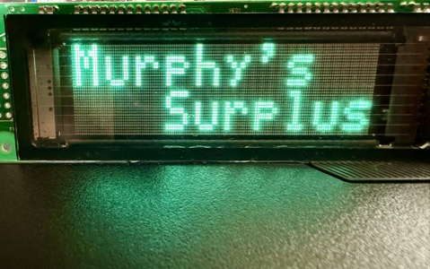
